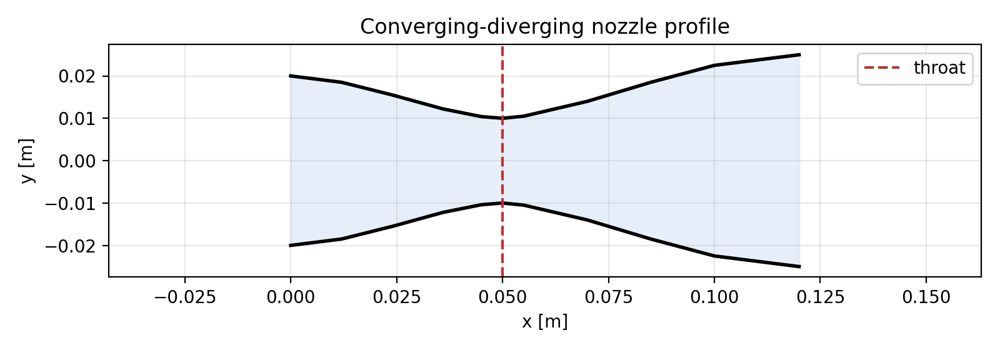
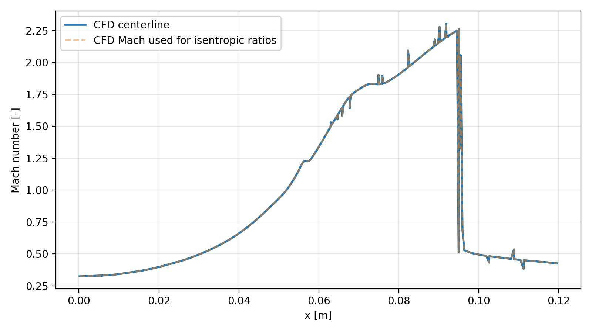
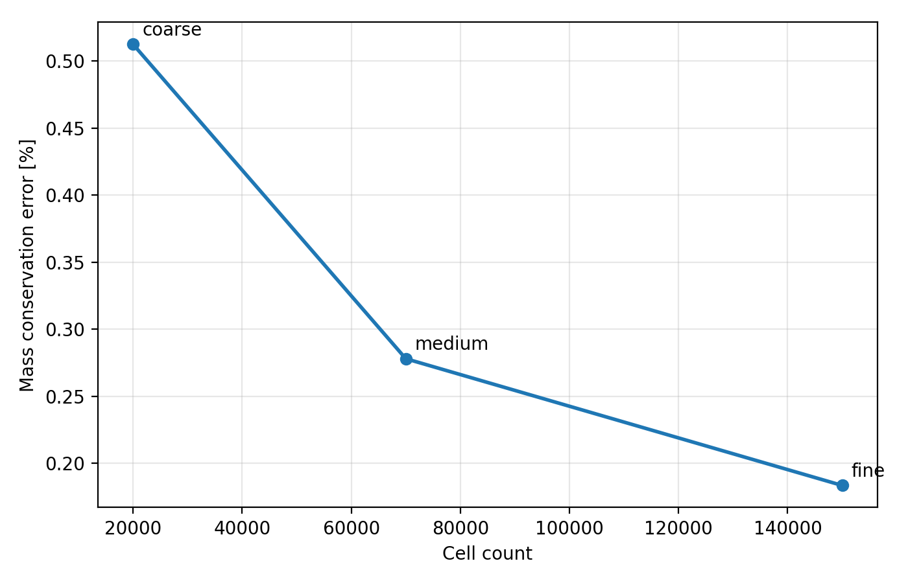
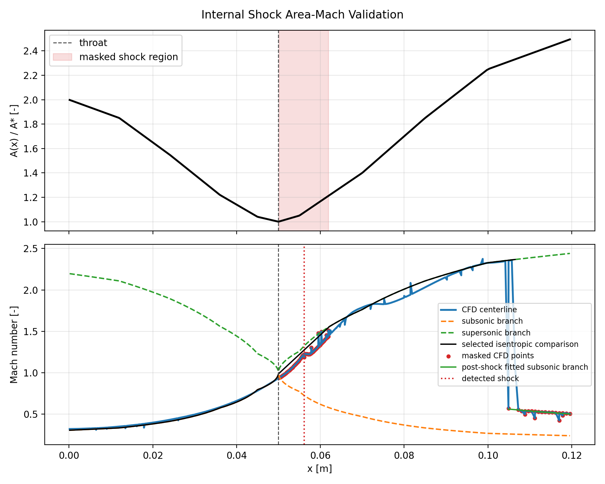
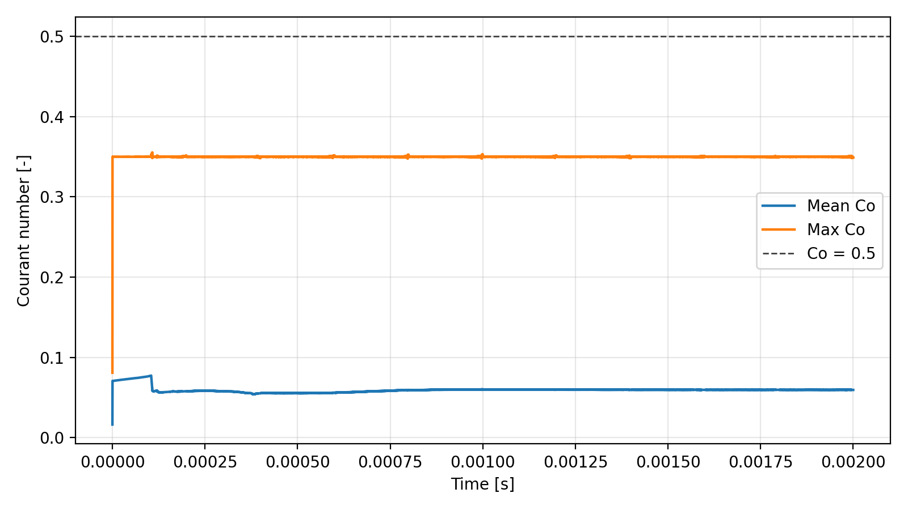
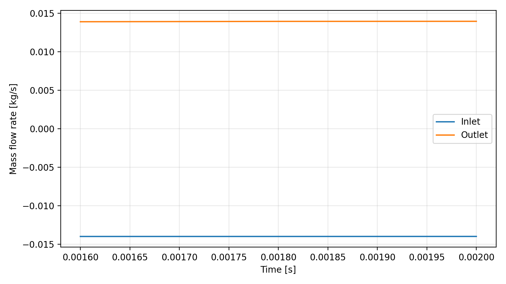

# Laval Nozzle CFD Validation

OpenFOAM portfolio project for compressible flow through a quasi-2D converging-diverging Laval nozzle. The work demonstrates setup, execution, validation, and post-processing of subsonic, choked, and internal-shock operating regimes using `rhoCentralFoam`, `blockMesh`, and direct field-based validation.

This is a compact CFD validation project intended for portfolio review. It is not a production-grade nozzle design package.

## Project Summary

The model is a quasi-2D Laval nozzle with ideal-gas air, slip walls, and `empty` front/back patches. Slip walls are used intentionally to emphasize inviscid/isentropic validation behavior rather than viscous boundary-layer prediction.

| Item | Configuration |
| --- | --- |
| Solver | OpenFOAM `rhoCentralFoam` |
| Mesh generator | `blockMesh` |
| Geometry | quasi-2D converging-diverging Laval nozzle |
| Gas model | ideal-gas air |
| Reservoir state | `p0 = 300000 Pa`, `T0 = 300 K` |
| Wall model | slip walls, intentional inviscid/isentropic reference setup |
| Primary validation | pressure-ratio regimes, mass conservation, Courant history, area-Mach comparison |
| Mass-flow method | direct `integral(rho * U dot n dA)` from saved `rho`, `U`, and mesh face areas |
| Flux fields | `phi`, `rhoPhi`, and `rho*phi` are not used for mass-flow validation |



## Key Results

All values below are from existing computed outputs in this repository.

| Case | Latest time | Observed regime | Throat Mach | Max Mach | Mass error | Max Co | Verdict |
| --- | ---: | --- | ---: | ---: | ---: | ---: | --- |
| `cases/subsonic` | 0.006 | fully subsonic | 0.480536 | 0.480536 | 0.690756% | 0.612799 | `VALID` |
| `cases/choked` | 0.002 | choked with internal-shock-like behavior | 1.03652 | 2.30388 | 0.277965% | 0.355479 | `VALID` |
| `cases/internal_shock` | 0.002 | choked with internal shock | 1.03577 | 2.36018 | 0.256732% | 0.201246 | `VALID` |

Primary summary files:

- [Validation summary](docs/validation_summary.md)
- [Pressure-ratio study](docs/pressure_ratio_study.md)
- [Mesh independence study](docs/mesh_independence.md)
- [Area-Mach validation](docs/area_mach_validation.md)
- [Time-history assessment](docs/time_history_assessment.md)

## Pressure-Ratio Study

The pressure-ratio cases use the same geometry and solver setup while reducing outlet static pressure.

| Case | `pb/p0` | Expected regime | Observed regime | Verdict |
| --- | ---: | --- | --- | --- |
| `subsonic` | 0.966667 | fully subsonic flow | fully subsonic | `VALID` |
| `choked` | 0.528333 | choked flow with divergent-section acceleration | choked with internal-shock-like behavior | `VALID` |
| `internal_shock` | 0.466667 | choked flow with an internal normal shock | choked with internal shock | `VALID` |

The computed Mach profiles confirm the intended progression from fully subsonic flow to sonic throat conditions and supersonic downstream flow. The `choked` case reaches a sonic throat but also shows internal-shock-like downstream behavior in the existing output; it is therefore documented honestly rather than presented as a clean shock-free isentropic expansion. The lower-back-pressure `internal_shock` case shows shock-containing behavior in the divergent section.



## Mesh Independence Study

The mesh study uses the choked operating point and varies only the `blockMeshDict` resolution.

| Mesh | Cells | Runtime [s] | Throat Mach | Max Mach | Mass error | Max Co | Verdict |
| --- | ---: | ---: | ---: | ---: | ---: | ---: | --- |
| `coarse` | 20000 | 463.85 | 1.04648 | 2.2641 | 0.512397% | 0.358095 | `VALID` |
| `medium` | 70000 | 3500.52 | 1.03652 | 2.30388 | 0.277965% | 0.355479 | `VALID` |
| `fine` | 150000 | 12863.8 | 1.0468 | 2.2675 | 0.183476% | 0.418804 | `VALID` |

Medium-to-fine throat Mach change is `0.0102739`, or `0.9815%` relative to the fine result. The medium mesh is sufficient for regime classification and validation-level conclusions. For strict quantitative throat-Mach reporting with an absolute tolerance of `0.01`, the fine mesh should be used or the residual medium-to-fine difference should be reported.




## Validation Methodology

The validation workflow reads OpenFOAM ASCII outputs directly and avoids hardcoded observed results.

Checks performed:

- latest numerical time and solver completion status
- Courant number history and final/max Courant values from solver logs
- mesh quality from existing `checkMesh` logs
- min/max `p`, `T`, `rho`, and Mach
- Mach computed from `|U| / sqrt(gamma R T)` when a saved `Ma` field is absent
- inlet/outlet mass flow from direct patch integration of `rho * U dot n dA`
- mass conservation error based on absolute inlet/outlet mass-flow magnitudes
- throat Mach and maximum Mach
- expected regime versus observed Mach topology
- validation verdict from mesh quality, stability, positivity, mass conservation, and regime consistency

Mass conservation criteria:

| Error | Classification |
| ---: | --- |
| `< 1%` | excellent |
| `< 3%` | acceptable |
| `3-5%` | marginal |
| `> 5%` | problematic |

## Area-Mach Validation

The area-Mach validation reconstructs `A(x)/A*` from `system/blockMeshDict`, solves the quasi-1D isentropic area-Mach relation for both subsonic and supersonic branches, and compares the result against the CFD centerline Mach number.

| Case | Area-Mach RMS Mach error | Valid points | Masked points | Shock location |
| --- | ---: | ---: | ---: | ---: |
| `subsonic` | 0.197192 | 459 | 0 | |
| `choked` | 0.569107 | 459 | 0 | |
| `internal_shock` | 0.0757175 | 370 | 89 | `x = 0.0561075 m` |

For the internal-shock case, the detected shock region is masked and isentropic theory is not applied through the shock. A downstream fitted subsonic branch is used only where the post-shock region has enough valid points.



## Time-History Assessment

Solver logs are parsed for time, `deltaT`, Courant number, and execution time. Mass-flow and throat-Mach histories are recomputed from written time directories using saved `rho`, `U`, `T`, and mesh geometry.

| Case | Log samples | Field samples | Max Co | Final mass error | Final throat Mach | Steadiness |
| --- | ---: | ---: | ---: | ---: | ---: | --- |
| `subsonic` | 106396 | 11 | 0.612799 | 0.690756% | 0.480624 | nearly steady |
| `choked` | 58939 | 3 | 0.355479 | 0.277965% | 1.04479 | quasi-steady |
| `internal_shock` | 104026 | 5 | 0.201246 | 0.256732% | 1.04399 | quasi-steady |

Field-based histories have only as many samples as saved time directories, not every solver step. No convergence claim is made from unsaved intermediate fields.





## How To Run

Requirements:

- OpenFOAM v2512 or compatible
- Python 3
- `numpy`
- `matplotlib`
- LaTeX distribution for report compilation

Install Python dependencies:

```bash
python3 -m pip install -r requirements.txt
```

Run a single case after sourcing OpenFOAM:

```bash
./Allrun cases/choked
```

Validate existing outputs without rerunning the solver:

```bash
./Allvalidate cases/choked
python3 scripts/validate_completed_cases.py
python3 scripts/advanced_validation.py
```

Perform safe cleanup of Python and LaTeX temporary files:

```bash
./Allclean
```

Deleting generated result directories is intentionally separated into `./AllcleanResults`, which prints the target directories and requires typing `DELETE_RESULTS`. It never deletes `0/` initial-condition directories.

Compile the report:

```bash
cd report
pdflatex -interaction=nonstopmode -halt-on-error laval_nozzle_report.tex
```

## Repository Structure

```text
LavalNozzle/
├── cases/
│   ├── subsonic/
│   ├── choked/
│   ├── internal_shock/
│   └── mesh_study/
│       ├── coarse/
│       ├── medium/
│       └── fine/
├── docs/
│   ├── data/
│   ├── images/
│   ├── area_mach_validation.md
│   ├── mesh_independence.md
│   ├── pressure_ratio_study.md
│   ├── time_history_assessment.md
│   └── validation_summary.md
├── scripts/
│   ├── advanced_validation.py
│   ├── validate_completed_cases.py
│   └── post-processing utilities
├── report/
│   ├── laval_nozzle_report.tex
│   └── laval_nozzle_report.pdf
├── Allrun
├── Allclean
└── Allvalidate
```

## Report

The compiled technical report is available here:

- [report/laval_nozzle_report.pdf](report/laval_nozzle_report.pdf)
- [report/laval_nozzle_report.tex](report/laval_nozzle_report.tex)

## Limitations

- Quasi-2D setup with `empty` front/back patches, not a full 3D nozzle.
- Slip walls are intentional for inviscid/isentropic validation; viscous wall losses and boundary layers are not modeled.
- Turbulence modeling is not a focus of this project.
- Shock location and strength are sensitive to mesh resolution, numerical scheme, and back pressure.
- Field-derived histories are limited by saved write intervals.
- Area-Mach theory is inviscid and isentropic; it is not applied through the detected shock region.
- This repository is a compact portfolio project, not a certified or production nozzle design workflow.

## Future Work

- Add automated regression tests for validation scripts.
- Add a viscous-wall variant to quantify boundary-layer and total-pressure-loss effects.
- Expand mesh refinement around the shock and throat for shock-position sensitivity.
- Add automated report generation as a single reproducible command.
- Add ParaView exports for subsonic and internal-shock fields.
- Compare against a dedicated quasi-1D solver for a more detailed analytical reference.

## Skills Demonstrated

- OpenFOAM `rhoCentralFoam` setup for compressible ideal-gas flow
- Structured `blockMesh` generation for quasi-2D nozzle geometry
- Pressure-ratio regime design for subsonic, choked, and shock-containing flow
- Direct OpenFOAM ASCII field parsing with Python
- Mass-flow integration from `rho`, `U`, and mesh face area vectors
- Courant, `deltaT`, execution-time, and steadiness assessment from solver logs
- Area-Mach relation reconstruction and branch comparison
- Shock-region detection and masking for non-isentropic validation
- Mesh independence assessment with runtime and mass conservation tracking
- Technical documentation and report generation for CFD portfolio review
