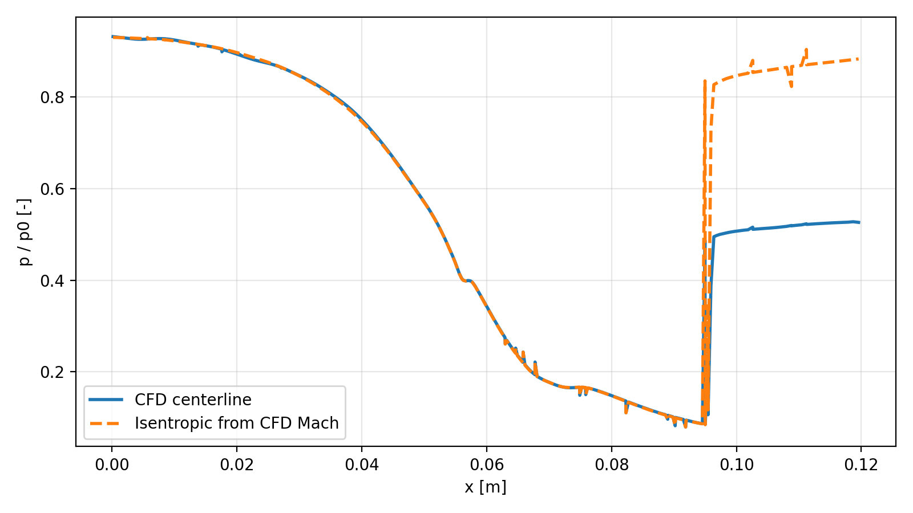
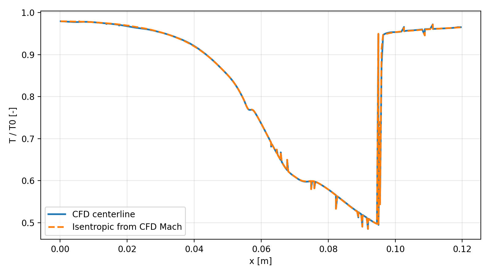
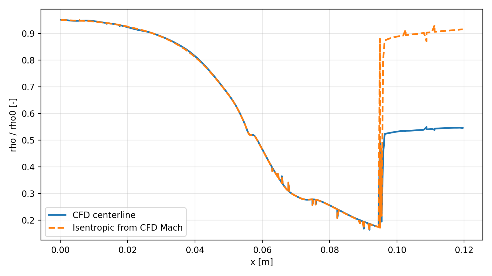
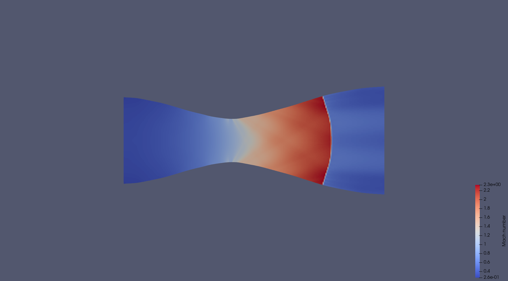
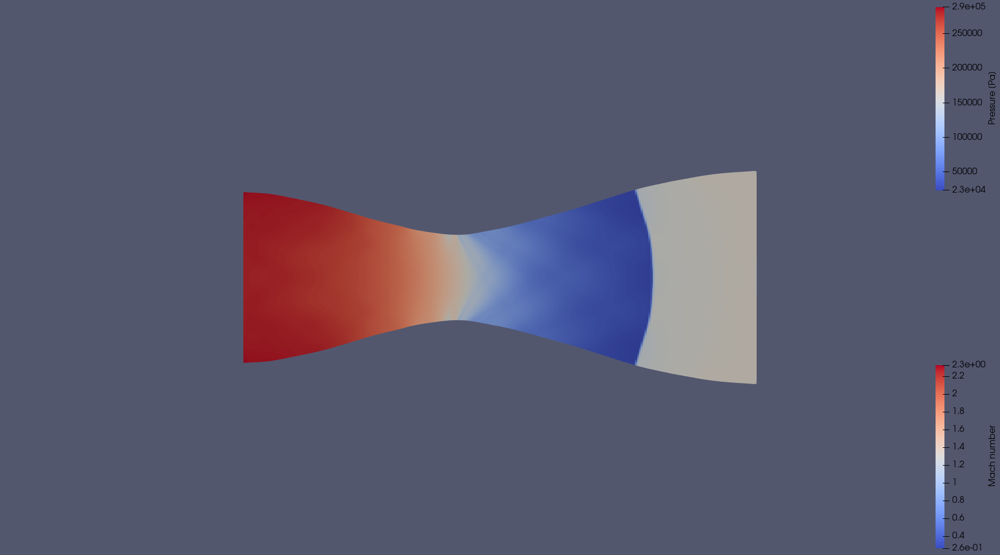
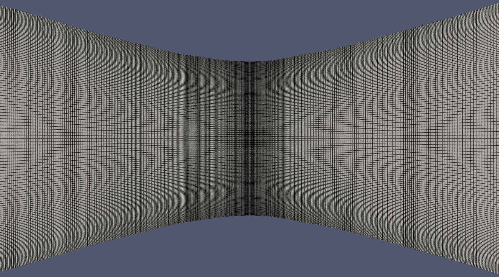
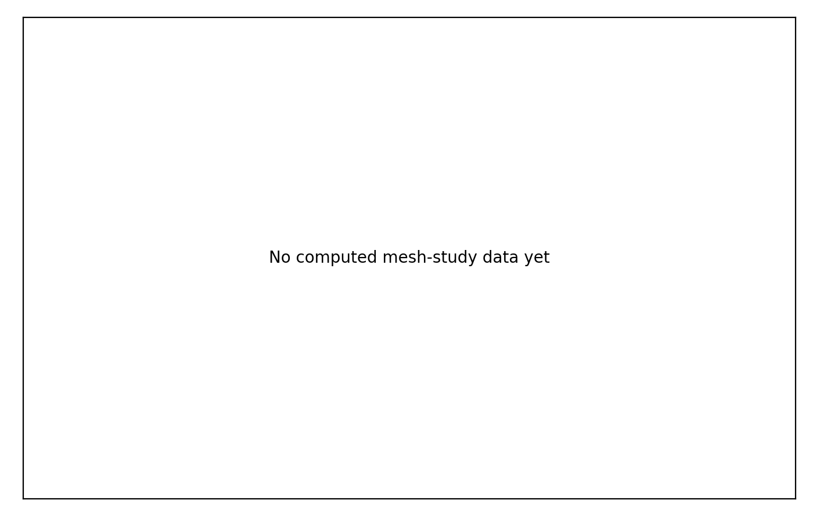

# Laval Nozzle CFD Portfolio Project

Compact OpenFOAM portfolio project for compressible flow through a quasi-2D converging-diverging Laval nozzle. The project demonstrates setup, execution, validation, and post-processing of subsonic, choked, and internal-shock nozzle operating regimes using a reproducible `blockMesh` workflow.

This is not a production-grade nozzle design package. It is a focused CFD validation project intended to show engineering judgment, numerical workflow discipline, and clear technical communication.

## Key Results

Current regenerated validation case: `cases/choked`

| Quantity | Value |
| --- | ---: |
| Solver | `rhoCentralFoam` |
| Mesh generator | `blockMesh` |
| Baseline / medium mesh size | approximately 70000 cells |
| Mass conservation error | 0.2780% |
| Maximum Courant number | 0.355479 |
| Throat-region Mach number | 1.03639 |
| Validation verdict | `VALID` |

These values are taken from the current regenerated choked-case validation summary. Regenerate them with `./Allvalidate cases/choked` after rerunning the case.

## Why This Project Matters

Laval nozzle flow is a compact but demanding CFD problem: it couples compressibility, choking, expansion, and possible shock formation in a geometry with a clear theoretical reference. That makes it useful for testing whether a simulation workflow can preserve mass, maintain stable time stepping, reproduce expected Mach behavior, and distinguish between physical regimes as back pressure changes.

For reviewers, this repository is intended to show:

- reproducible OpenFOAM case organization
- conservative solver controls for compressible flow
- direct validation from OpenFOAM ASCII fields
- clear separation between generated outputs and source dictionaries
- documented limitations and next steps

## Physics Background

The nozzle is a quasi-2D converging-diverging duct. Air is modeled as an ideal gas with `gamma = 1.4`, inlet total temperature `T0 = 300 K`, and inlet total pressure `p0 = 300000 Pa`.

For an ideal inviscid nozzle, reducing outlet static pressure `pb` changes the flow regime:

- high `pb/p0`: fully subsonic flow
- near the critical pressure ratio: choked flow with Mach approximately 1 at the throat
- lower `pb/p0`: supersonic expansion in the divergent section
- intermediate low back pressure: normal shock inside the divergent section

Slip walls are used intentionally. The goal is inviscid/isentropic validation behavior, not wall-bounded viscous boundary-layer prediction.

## Numerical Setup

| Item | Setting |
| --- | --- |
| Solver | `rhoCentralFoam` |
| Mesh | `blockMesh` only |
| Geometry | quasi-2D converging-diverging nozzle |
| Front/back patches | `empty` |
| Wall patches | `slip` |
| Gas model | ideal gas air |
| Baseline cell count | approximately 70000 |
| Time stepping | adjustable time step with conservative Courant target |
| Main validation fields | `rho`, `U`, `p`, `T`, `Ma` when available |

Mass flow validation does not require `phi`, `rhoPhi`, or `rho*phi`. It is computed directly from mesh geometry and cell fields:

```text
mdot = integral(rho * U dot n dA)
```

## Repository Structure

```text
LavalNozzle/
├── cases/
│   ├── baseline_choked/
│   ├── subsonic/
│   ├── choked/
│   ├── internal_shock/
│   └── mesh_study/
│       ├── coarse/
│       ├── medium/
│       └── fine/
├── docs/
│   ├── images/
│   ├── mesh_independence.md
│   ├── paraview_export_guide.md
│   ├── pressure_ratio_study.md
│   ├── validation_choked.md
│   ├── validation_subsonic.md
│   └── validation_summary.md
├── scripts/
├── report/
├── Allrun
├── Allclean
└── Allvalidate
```

## How To Run

Requirements:

- OpenFOAM v2512 or compatible
- Python 3
- `numpy`
- `matplotlib`

Install Python dependencies:

```bash
python3 -m pip install -r requirements.txt
```

Source OpenFOAM, then run a selected case:

```bash
./Allclean cases/choked
./Allrun cases/choked
```

Validate an existing solved case:

```bash
./Allvalidate cases/choked
```

Run the three pressure-ratio cases:

```bash
./Allrun cases/subsonic
./Allrun cases/choked
./Allrun cases/internal_shock
```

Run mesh-study cases individually:

```bash
./Allrun cases/mesh_study/coarse
./Allrun cases/mesh_study/medium
./Allrun cases/mesh_study/fine
python3 scripts/mesh_independence.py
```

The mesh-study cases are not run automatically.

## Validation Methodology

The validation scripts parse OpenFOAM ASCII files directly where possible. The workflow checks:

- mesh quality from `checkMesh`
- Courant number history from solver logs
- direct inlet/outlet mass conservation using `rho`, `U`, owner cells, and patch face area vectors
- pressure, temperature, density, and Mach bounds
- throat choking behavior
- centerline comparisons with isentropic relations
- area-Mach relation validation from nozzle geometry
- time-history steadiness over the last 10% of available samples

Mass conservation criteria:

| Error | Classification |
| ---: | --- |
| `< 1%` | excellent |
| `< 3%` | acceptable |
| `3-5%` | marginal |
| `> 5%` | problematic |

Steadiness criteria:

| Last-10% relative variation | Classification |
| ---: | --- |
| `< 1%` | quasi-steady |
| `1-5%` | nearly steady |
| `> 5%` | still transient |

## Results

Generated validation plots currently included in the repository:









ParaView screenshot export instructions are provided in `docs/paraview_export_guide.md`. Expected screenshot filenames include:

- `docs/images/choked_mach_contour.png`
- `docs/images/choked_pressure_contour.png`
- `docs/images/choked_mesh_throat.png`

Current ParaView exports from the regenerated choked case:







Those images are generated from actual ParaView exports; no synthetic contour placeholders are committed.

## Pressure-Ratio Study

The pressure-ratio study compares three operating points with the same geometry and solver setup:

| Case | `pb/p0` | Current status | Expected regime |
| --- | ---: | --- | --- |
| `cases/subsonic` | 0.967 | valid | fully subsonic flow |
| `cases/choked` | 0.528 | valid | Mach approximately 1 at throat, with supersonic divergent-section acceleration in the regenerated result |
| `cases/internal_shock` | 0.467 | valid | supersonic region followed by detected internal shock |

Study outputs:

- `docs/pressure_ratio_study.csv`
- `docs/pressure_ratio_study.md`

Observed quantities are populated only from computed case output. The study intentionally avoids hardcoding observed results.
All three pressure-ratio cases currently have regenerated validation data; the mesh-independence cases remain pending.

## Mesh Independence Study

The mesh study uses the choked case physics and varies only `blockMeshDict` resolution:

| Mesh | Target cells |
| --- | ---: |
| `cases/mesh_study/coarse` | approximately 20000 |
| `cases/mesh_study/medium` | approximately 70000 |
| `cases/mesh_study/fine` | approximately 150000 |

Current study plots:




The medium mesh is the intended portfolio default because it matches the validated 70000-cell baseline. It should be considered sufficient only after comparing medium and fine results for throat Mach and mass flow sensitivity.

## Limitations

- Quasi-2D setup with `empty` front/back patches, not a full 3D nozzle.
- Slip walls are used intentionally for inviscid/isentropic validation; viscous boundary layers and wall heat transfer are not modeled.
- Turbulence modeling is not the focus of this project.
- Shock position and strength are sensitive to mesh resolution, numerics, and back pressure.
- Some figures depend on rerunning cases and post-processing scripts.
- This repository is a compact portfolio project, not a certified or production design workflow.

## Future Work

- Add automated regression tests for validation scripts.
- Run and document the mesh-independence study.
- Add ParaView screenshots for the subsonic and internal-shock cases, including the detected shock region.
- Compare against analytical quasi-1D area-Mach predictions more systematically for each regime.
- Add a viscous-wall variant to show boundary-layer and total-pressure-loss effects.
- Package post-processing into a single reproducible report-generation command.

## Skills Demonstrated

- OpenFOAM case setup for compressible flow
- `rhoCentralFoam` workflow and runtime control
- Structured `blockMesh` generation for a quasi-2D nozzle
- Ideal-gas and isentropic compressible-flow validation
- Direct field parsing and post-processing with Python
- Mass-flow integration from mesh geometry
- Courant/time-history analysis
- Area-Mach relation validation
- Mesh independence study design
- Technical documentation for GitHub and portfolio review
